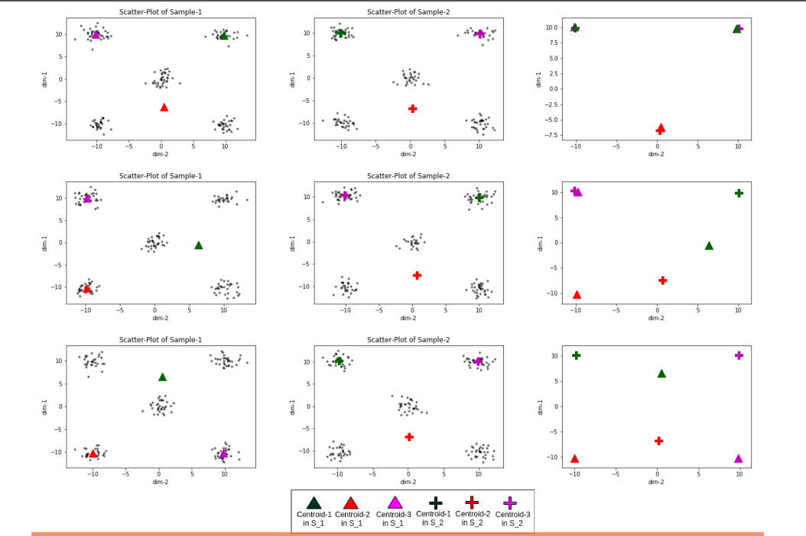
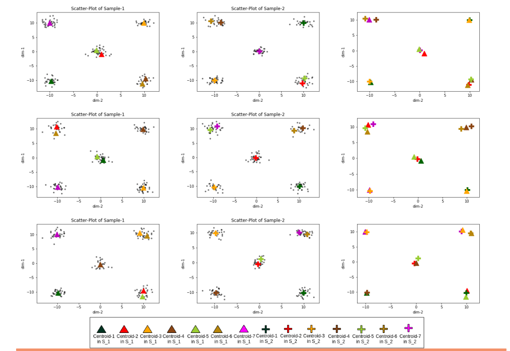
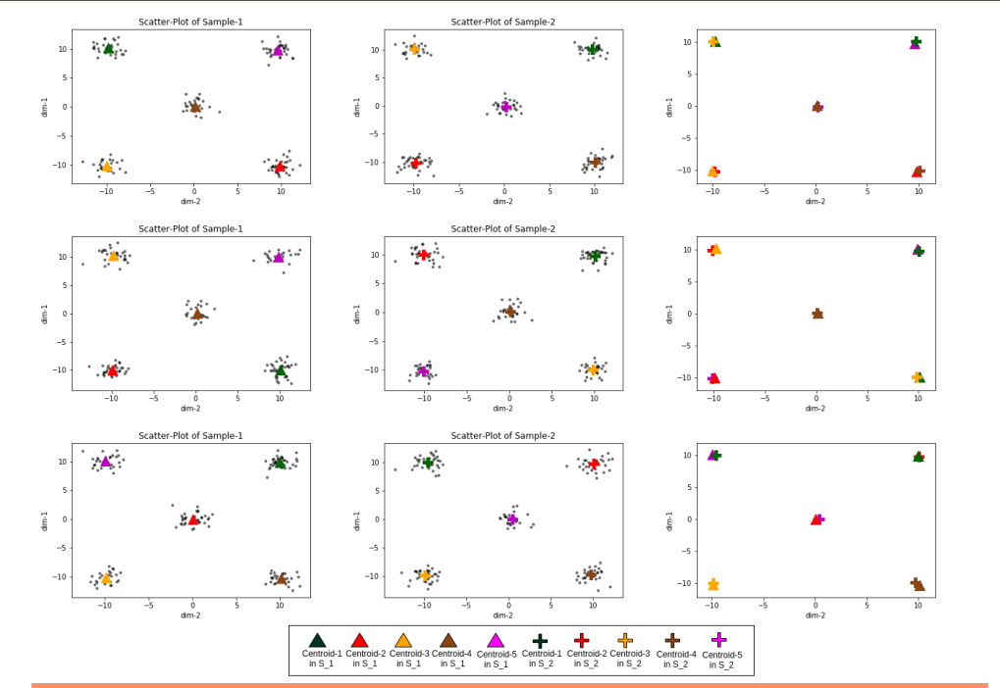

# CNAK

The CNAK module provides a K-means based algorithm which does not require pre-declaration of  K. It can detect appropriate cluster number within the data and useful for handling big data.

This method can solve a few pertinent issues of clustering a dataset.

- 	 Detection of a single cluster in the absence of any other cluster in a dataset.
- 	 The presence of hierarchy.
- 	 Clustering of a high dimensional dataset.
- 	 Robustness over dataset having cluster imbalance.
- 	 Robustness to noise.

###### This method is not applicable to different shaped dataset.

## Fundamental observation

#### Intuition : 

The choice of K is governed by the  positional behavior of any two sets of the centroids.

    1.	 K < K_opt
    2.	 K = K_opt
    3. 	 K > K_opt
    
   K_opt is the optimal cluster number for the given dataset
   
#### Experiment:

Experiment is conducted on a dataset where 5 clusters are well separated. i.e, K_opt=5. We have conducted with K=3 (K < K_opt),  5 (K= K_opt), and 7 (K > K_opt).

#### Observation :

Figure 1: Each row shows the positional behavior of cluster centroids chosen by K-means\++ in a pair of samples H (S\_1, S\_2). First and second column of each row depicts randomly selected sample distributions with cluster centroids generated by K-means++ with K=3. Third column depicts a plot where set of centroids generated from S\_1 and S\_2 are plotted.

Figure 2: Each row shows the positional behavior of cluster centroids chosen by K-means\++ in a pair of samples H (S\_1, S\_2). First and second column of each row depicts randomly selected sample distributions with cluster centroids generated by K-means++ with K=7. Third column depicts a plot where set of centroids generated from S\_1 and S\_2 are plotted.

Figure 3: Each row shows the positional behavior of cluster centroids chosen by K-means\++ in a pair of samples H (S\_1, S\_2). First and second column of each row depicts randomly selected sample distributions with cluster centroids generated by K-means++ with K=5. Third column depicts a plot where set of centroids generated from S\_1 and S\_2 are plotted.

-	K = K_opt : The centroids of two samples for a given pair are very close to each other for all three cases. However, the situation is different when K ≠ K_opt.
- K ≠ K_opt : It has a very interesting observation.
	
	+ They still may be close to each other even when all the cluster centroids do not represent true centroids.
		
	+ They may be randomly scattered. The probability of occurring the  case is increasing with a growing number of observed pairs of samples.

	Intuitively, more than one centroids get assigned to a compact cluster when a data is partitioned with K > K_opt. Interestingly, a compact cluster that may split varies in different samples.
    
#### Conclusion on the experiment :

	1. It indicates that for a dataset, other than K=K_opt there is a high chance of having a pair of centroids whose distance is larger 
       compared to the other pairs under observation.

	2. The number of such cases increases with increasing pairs of observations.
	
	3. Therefore, the average distance between a pair of centroids is expected to be higher for K ≠ K_opt.
	
	4. The distortion would be high when K is non-optimal. Hence, the positions of centroids in various samples provide random behavior for K=3 and K=7.

# Dependency

    numpy>=1.15.4.
    sklearn>=0.20.1
    munkres (by Brian M. Clapper)
# Demo

CNAK demo:

	python CNAK.py -f "sim2_12.csv"
    or
	python CNAK.py -p "file-path" -f "sim2_12.csv" -g 0.27 -k1 4 -k2 7

Check that this script creates following files in  the current directory and return  K_opt.

	CNAK_labels.txt (Predicted labels for optimal K)
    CNAK_scores.csv (CNAK score for K=k1 to k2)
    
One may run the following command to see the description of required command-line arguments in CNAK.py. It is advisable to read the paper before you set the value after -g. This value is important while the dataset is very large (#data-points ~ 10^7)

	python CNAK.py --help

# Publication

Cite our paper if you use our code.

@article{SAHA2020,
author = "Jayasree Saha and Jayanta Mukherjee",
title = "CNAK : Cluster Number Assisted K-means",
journal = "Pattern Recognition",
pages = "107625",
year = "2020",
issn = "0031-3203",
doi = "https://doi.org/10.1016/j.patcog.2020.107625",
url = "http://www.sciencedirect.com/science/article/pii/S0031320320304283",
}

